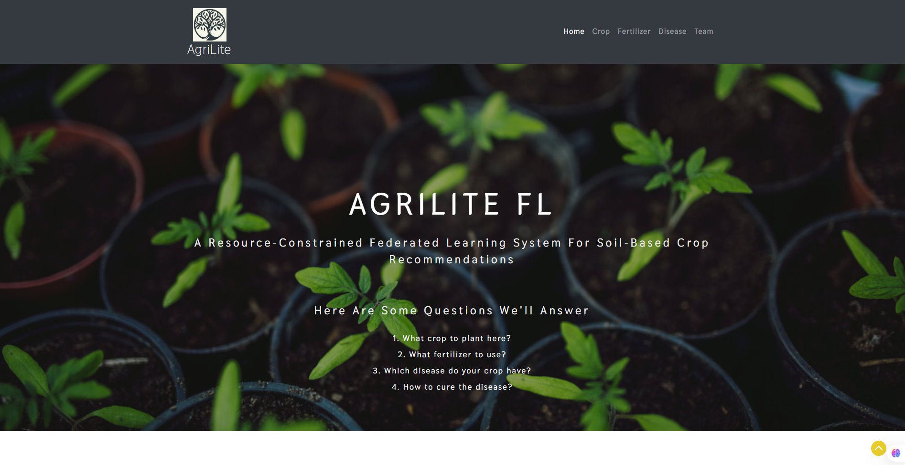
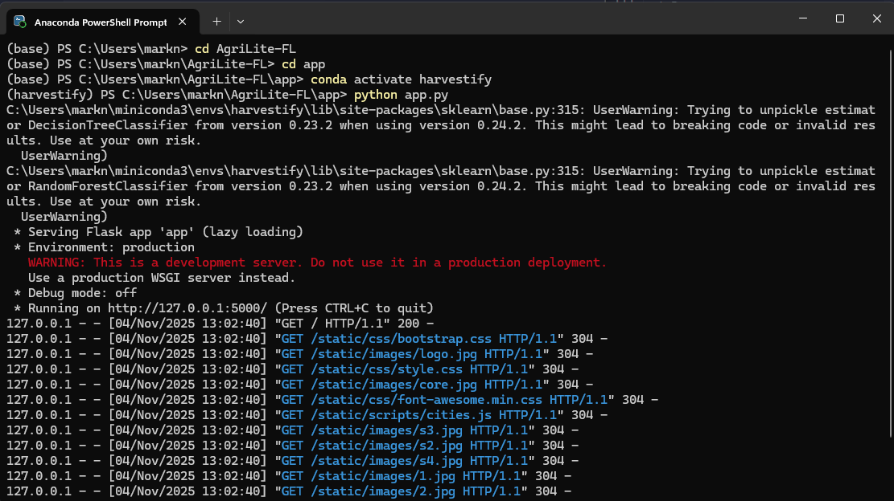

# 🌾 AgriLite-FL

*A Resource-Constrained Federated Learning System for Soil-Based Crop Recommendations*

## 🌍 Overview

**AgriLite-FL** is an intelligent and lightweight agricultural analytics platform designed for smallholder farmers in Africa, particularly in regions like Zimbabwe.
It integrates **Federated Learning (FL)**, **Computer Vision (CV)**, and **Natural Language Processing (NLP)** to provide farmers with actionable insights — while ensuring **data privacy**, **local adaptability**, and **low computational cost**.

The project extends ideas from **Harvestify** and integrates concepts inspired by the **Multiverse of 100+ Data Science Project Series** repository to enhance modularity, scalability, and learning efficiency.



<br>

### Team

#### AgriLite Team Members

| Name                        | Role/Position        | ID        |
|-----------------------------|----------------------|-----------|
| Donald Muyena               | DevOps Engineer       | 2030303   |
| Ruendo Zimbodza             | AI Researcher        | 2030135   |
| Grace N. Ndhuju             | UI & UX Designer     | 220044    |
| Anotidaishe Mutasa          | AI Project Manager   | 2300138   |
| Mark Chindori               | Applied Scientist $ Lead Developer | 2300177   |
| Tafiwanshe Chifura          | AI Researcher         | 2300124   |
| Jeremy Mukadi               | Domian Expert         | 230063    |
| Tarapadficta Kasibe         | AI Project Lead       | 230059    |
| Christian Nkala             | Ethics Analyst        | 230059    |
| Michael T. Mafemba          | Quality Assurance     | 230063    |
| Farai Mawire                | Marketing Specialist  | 230063    |

### Additional Suggestions
- **Roles/Positions:** You can specify roles or responsibilities for each team member if applicable to provide more context.
- **Contact Information:** Consider adding email addresses or links to LinkedIn profiles for professional connectivity (ensure privacy and consent).
- **Photos:** Including photos of team members can make the section more personable and engaging.

You can place this section in the documentation after the **Introduction** or **Contributions** sections to highlight the people behind the project.

## 🎯 Core Objectives

1. **Empower Local Farmers** through accessible, AI-driven tools that assist in crop, fertilizer, and disease management.
2. **Preserve Data Privacy** using federated learning — ensuring all farm data remains on the user’s local device.
3. **Enable Regional Adaptability** by designing a system responsive to different environmental and soil conditions.
4. **Enhance Productivity & Sustainability** through explainable AI models that support informed decision-making.
5. **Integrate Conversational Interfaces** (Chatbot) to improve accessibility, education, and remote support for farmers.

<br>

## 💪 Project Motivation

Agriculture drives economic growth in Zimbabwe and across Africa. However, farmers often lack access to real-time data and digital tools.
**AgriLite-FL** bridges that gap by offering a **privacy-preserving, federated AI platform** for:

* **Crop Recommendation:** Suggests suitable crops based on soil data.
* **Fertilizer Recommendation:** Advises which fertilizers to use to balance nutrient content.
* **Disease Detection:** Identifies plant diseases via leaf image analysis and provides treatment guidance.

<br>

## 📊 Data Sources

* **Crop Recommendation Dataset:** Customized for African soils.
* **Fertilizer Suggestion Dataset:** Built from local agricultural data.
* **Disease Detection Dataset:** Based on regional crop diseases and imagery.

<br>

## 🧠 System Components

### 1. **Federated Learning Engine (FL Core)**

* **Frameworks:** Flower • TensorFlow Federated • PySyft
* **Goal:** Enable collaborative model training without data centralization.
* **Features:**

  * Lightweight model aggregation
  * Asynchronous updates for low connectivity
  * Differential privacy for secure training

### 2. **Computer Vision Modules 📷**

* **Disease Diagnosis:** Detect crop diseases using phone-captured leaf images.
* **Yield Prediction:** Estimate yield using soil, environment, and crop data.

### 3. **Soil-Based Crop Recommendation 🌱**

* **Input:** Soil pH, NPK levels, moisture, and location.
* **Output:** Best-suited crops and fertilizers for local conditions.

### 4. **AgriLite Chatbot 🤖**

* Offers **interactive, multilingual assistance** (English and Shona).
* Provides **crop**, **fertilizer**, and **disease** recommendations in a conversational way.

<br>

## 🏗️ Technical Architecture

* **Edge Devices:** Collect local data and run inference offline.
* **Federated Server:** Aggregates model updates securely.
* **Data Sources:** Sensors, weather APIs, and user inputs.
* **Storage:** Global model and performance logs.
* **Dashboard:** For monitoring model drift and insights.

<br>

## 🚀 Deployment

* **Branch:** `deploy`
* **Platform:** Heroku (or local Flask server)
* **URL:** *(Insert your deployed link)*

> ⚠️ *Note: The website may take a minute to load if the server is hibernating.*

<br>

## 💻 How to Run Locally

Follow these steps to run **AgriLite-FL** on your machine:

1. **Install Prerequisites**

   * Ensure `git`, `Anaconda`, or `miniconda` are installed.

2. **Clone the Repository**

   ```bash
   git clone https://github.com/yourusername/AgriLite-FL.git
   cd AgriLite-FL
   ```

3. **Create and Activate the Environment**

   ```bash
   conda create -n harvestify python=3.6.12
   conda activate harvestify
   pip install -r requirements.txt
   ```

4. **Navigate to the App Directory**

   ```bash
   cd app
   ```

5. **Run the Flask Application**

   ```bash
   python app.py
   ```

   ✅ If successful, your terminal will show:

   ```
   * Running on http://127.0.0.1:5000/
   ```

   Then open your browser and visit the address above.

> ⚠️ *If you see a warning like “Trying to unpickle estimator DecisionTreeClassifier from version 0.23.2…” — it’s harmless. It just means the model was trained in an older sklearn version.*

<br>


<br>

## 🧩 How to Use

### 🌾 Crop Recommendation

Enter soil nutrient data (N, P, K), pH, and your location to get crop suggestions.

### 🌿 Fertilizer Suggestion

Provide soil and crop details; the model will identify deficiencies and recommend specific fertilizers.

### 🍃 Disease Detection

Upload a plant leaf image to get disease diagnosis and treatment advice.

---

## 👨‍💻 Contributing

Please read `CONTRIBUTING.md` for details on contribution guidelines and pull request processes.

---

## 📈 Future Improvements

* Improve front-end design and responsiveness.
* Add more localized data for Zimbabwean soils and crops.
* Expand the disease detection dataset for higher accuracy.
* Deploy federated learning updates across multiple regions.

---

## 💳 Credits

* Inspired by [Harvestify](https://github.com/Gladiator07/Harvestify) and
  [Multiverse of 100+ Data Science Projects](https://github.com/Chando0185/Multiverse_of_100-_data_science_project_series).
* Extended and customized for **African smallholder farmers**.

---

## 📝 License

Licensed under the **GNU General Public License (GPL)**.

---

## 📞 Contact

👤 **Mark Chindudzi** - Applied Scientist & Developer
📧 Email: chindudzim@africau.edu
🔗 LinkedIn: https://www.linkedin.com/in/marknature-c/
🌍 Africa University | Zimbabwe
